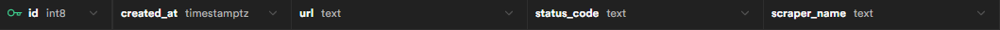
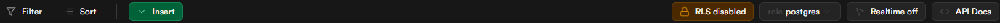

# Project :

## Description :

It's a small project for scrape webpage.

A frontend in React and TypeScript with Chakra UI.

A backend in python with Flask.

The database used is supabase.

## Install frontend dependances :

```shell
cd frontend
npm i
```

Generate pre build components of Charkra UI :

```shell
npx @chakra-ui/cli snippet add
```

## Setup database :

Create a Supabase account and create a Project.

Connect to Supabase dashboard and select your project, create the table requests in the table Editor with the rows :



Disable RLS (top right) :



## Config backend :

Create/Change the file scraper/.env :

SUPABASE_URL and SUPABASE_KEY with the settings of your project.

.env : 

```txt
PORT=5000
DEBUG=True
SUPABASE_URL=...
SUPABASE_KEY=...
```

## Start docker :

```shell
docker-compose up --build
```